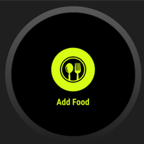
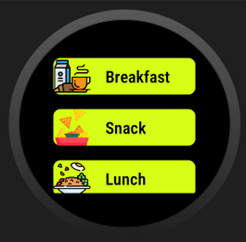
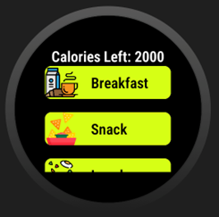
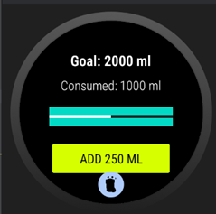
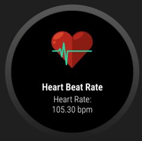
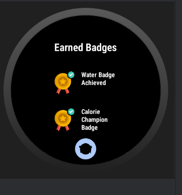

# Health Booster 🌟

HealthBooster is a wearable app designed to promote a healthier lifestyle by enabling users to track their food intake, water consumption, steps, heart rate, and calorie goals. The app integrates with Android Wear devices, offering a seamless experience for health-conscious individuals.

## Features

- **Add Food Tracking**:
  - Record meals (breakfast, lunch, dinner, snacks) with predefined calorie values.
  - Adjust calorie goals dynamically and receive notifications when goals are achieved.

- **Heart Rate Monitoring**:
  - Real-time heart rate tracking using Android's heart rate sensor.
  - Notifications for abnormal heart rate levels (too high or too low).

- **Step Counter**:
  - Counts steps using Android's step counter sensor.
  - Calculates calories burned based on steps and notifies users when they reach daily calorie goals.

- **Water Tracker**:
  - Set daily water intake goals.
  - Log water consumption and track progress with a visual progress bar.
  - Notifications for halfway and full completion of water goals.
  - Earn badges for completing daily water intake goals.

- **Badges and Rewards**:
  - Earn motivational badges for meeting health goals, including calorie and water goals.
  - View all earned badges in a dedicated badge list.

## Technical Details

- **Frontend**: Java and Android XML layouts using View Binding for a clean and dynamic UI.
- **Backend**:
  - Java
  - Android Room Database for local data storage.
  - Preference storage for user settings (calorie goals, water intake, etc.).
- **Sensors**:
  - Heart rate sensor for monitoring heart activity.
  - Step counter sensor for tracking daily activity.
- **Notifications**:
  - Dynamic notifications for goal achievements, abnormal heart rates, and reminders.
- **Wearable Integration**:
  - Built specifically for Android Wear OS devices.

## Screenshots 📸

### Calorie Tracker
  
  
  
*Track your daily calorie intake and set goals.*

### Water Consumption
  
*Log your water intake and monitor hydration levels.*

### Step Counter
  
*Track steps taken and calories burned throughout the day.*

### Heart Rate Monitor
  
*Monitor your heart rate and receive insights on your activity.*

### Badge Rewards
  
*Earn badges for reaching milestones and view your achievements.*

## Contributors 🤝
- Ajay Dhillon
- Vatsal Chauhan
- Rahul Acharya
- Sagar Parajuli

